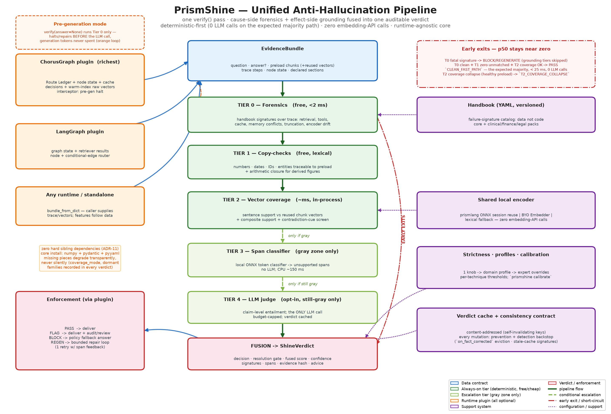

# PrismShine — Architecture Design

Status: **design approved for implementation planning** · Jul 2026
Audience: the implementation-planning agent and developers of the Insight ecosystem.


*(regenerate with `python docs/diagrams/make_architecture_map.py`)*

---

## 1. Problem statement

Production agent hallucinations have two root causes, in observed order of frequency:

1. **Broken preload (cause-side).** The context sent to the LLM was incomplete or wrong: retrieval returned nothing or low-relevance chunks, a tool/API call failed and the error was swallowed, context was truncated, a stale cache entry was reused, or the memory layer served a conflicted/uncommitted fact. The model then fills the gap with plausible invention.
2. **Ungrounded generation (effect-side).** The preload was fine, but the model ignored or distorted it — fabricated numbers, unsupported claims, wrong entity attribution.

Every existing market tool (LLM-as-judge, encoder classifiers, geometric scorers, eval platforms) only addresses (2), because they sit outside the runtime and only ever see `(context, question, answer)`. PrismShine is runtime-agnostic (§8.1) but designed to plug *inside* whatever runtime hosts it — richest inside ChorusGraph — so it can address (1) deterministically and for free, and (2) with maximal reuse of runtime artifacts.

## 2. Goals / non-goals

**Goals**

- One unified `verify()` pipeline producing a single auditable verdict — cause-side and effect-side signals fused, never exposed as separate "phases" to the developer.
- Deterministic-first: 0 LLM calls for the overwhelming majority of requests.
- Zero *extra* embedding cost: reuse every vector the runtime already produced; never call an embedding API.
- Audit-grade output: named resolution gate, firing signatures, unsupported spans, evidence hash — replayable and ledger-attachable (PrismGuard/PrismCortex style).
- **Runtime-agnostic core, plugin runtimes.** The core (`ShineGate` + tiers + handbook) depends on nothing but numpy/pydantic and consumes only the neutral `EvidenceBundle` contract. ChorusGraph, LangGraph, and any other runtime attach as plugins implementing the runtime plugin contract (§8.1). ChorusGraph is the *richest* plugin (full ledger forensics), never a required one.
- Actionable outcomes: not just a score — `pass / flag / block / regenerate` policies with domain profiles.

**Non-goals**

- Not a world-truth fact checker. PrismShine verifies grounding *in the preload evidence*, not against external world knowledge. (An optional Tier-4 judge can add world-knowledge checks, but that is escalation, not the core.)
- Not an input guard (that is PrismGuard) and not an eval platform (that is the eval-harness gap, out of scope).
- Not a retrieval improver. It detects retrieval failures; fixing retrieval quality remains prismrag-patch / PrismResonance territory.

## 3. The unified pipeline

A single pass through `ShineGate.verify(bundle)`. Tiers run in cost order; each tier appends `Signal`s to one shared pool; fusion runs once at the end (with early-exit shortcuts). There is no separate "Path 1 report" and "Path 2 report" — one `ShineVerdict`.

```
EvidenceBundle
     │
     ▼
Tier 0  FORENSICS (free, deterministic)
        Handbook signature detectors over ledger steps, node states,
        cache decisions, retrieval scores, tool results, memory conflicts.
        → signals: preload_health, signature hits
        → shortcut: fatal signature (e.g. EMPTY_RETRIEVAL on a must-ground
          section) can short-circuit to BLOCK/REGENERATE before any
          answer analysis — or, in pre-generation mode, before the LLM
          call is made at all (§7.2).
     │
     ▼
Tier 1  COPY-CHECKS (free, lexical)
        Numbers, dates, currencies, IDs, named entities in the answer must
        be traceable to the preload (normalized matching). Unmatched
        numbers get an ARITHMETIC-CLOSURE pass (sum/diff/ratio/percent of
        preload numbers) before being flagged, so derived figures don't
        false-positive.
        → signals: unmatched_fact_count, unmatched fact spans,
                   derived_fact_count
     │
     ▼
Tier 2  VECTOR COVERAGE + CONTRADICTION CUES (cheap, in-process, reused vectors)
        Sentence-level alignment of answer against preload chunk vectors
        with COMPOSITE SUPPORT (evidence union across chunks) for
        comparative/aggregative sentences. Context vectors: reused (never
        re-embedded). Answer sentences: encoded once via the shared local
        ONNX encoder session (§6). Then a CONTRADICTION-CUE screen on
        well-supported sentences: negation/opposite-verb asymmetry vs the
        best-supporting chunk promotes the sentence to Tier 3 instead of
        letting high cosine pass it.
        → signals: coverage score, uncovered sentence spans,
                   contradiction_cue spans
     │
     ▼ (only if fusion is in the gray zone so far)
Tier 3  SPAN CLASSIFIER (no LLM; local ONNX encoder model)
        Token-classification over (context, question, answer) — flags
        unsupported spans (LettuceDetect-class model, ONNX runtime).
        → signals: unsupported_span_ratio, spans
     │
     ▼ (only if still gray AND judge is enabled)
Tier 4  LLM JUDGE (opt-in escalation)
        Claim-level entailment via configured judge model. The only tier
        that costs an LLM call. Verdict cached content-addressed.
        → signals: judge_verdict, per-claim support
     │
     ▼
FUSION → ShineVerdict {decision, resolution_gate, fused_score,
                       signatures[], spans[], evidence_hash, tier_reached}
```

### Early-exit rules (keep p50 latency near zero)

- Tier 0 fatal signature + policy `halt_on_fatal` → immediate verdict, gate = signature name.
- Tier 1 zero unmatched facts AND Tier 2 coverage ≥ `pass_threshold` AND Tier 0 clean → immediate PASS, gate `CLEAN_FAST_PATH`. This is the expected majority path.
- Only gray-zone traffic ever reaches Tier 3; only "still gray" traffic reaches Tier 4.

### 3.1 Tier-0 outcome protocol (what happens when forensics fires)

One decision vocabulary (`pass / flag / block / regenerate`) with moment-specific meaning. In **pre-generation mode** (`answer=None`): `pass` → proceed to the LLM call; `flag` → proceed, verdict recorded and strictness stepped up for this run; `block` → halt, no LLM call, integration returns the policy fallback (e.g. honest "I don't have the data for that" disclosure — never a silent empty answer); `regenerate` → **repair**: route back to the failing hop with the signature's `advice` as structured feedback (re-run retrieval with adjusted params, retry the tool), bounded exactly like ADR-7 (default 1 attempt, then degrade to `block` or `flag` per policy).

| Severity | Pre-generation (interceptor) | Post-generation |
|---|---|---|
| `fatal` | halt the LLM call; policy chooses `block` (fallback answer) or `regenerate` (bounded repair of the failing hop) | short-circuit to `block`/`regenerate`; grounding tiers skipped — a broken preload cannot be "passed" by good-looking coverage |
| `error` | proceed, but strictness +1 for this run; heavy fusion contribution | heavy fusion contribution; typically lands the verdict in the act band unless grounding is impeccable |
| `warning` | proceed; contributes to the aggregated warning signal (weight 0.25) | same |
| `info` | recorded in verdict only; no score contribution | same |

Every fired signature — regardless of outcome — is written into the verdict and the ledger with its evidence pointer, so "we proceeded despite a warning" is itself an auditable fact.

## 4. Data model

All models are pydantic (ecosystem convention).

### 4.1 EvidenceBundle (input)

The single input object. Adapters construct it from ChorusGraph runs or from raw dicts (standalone mode).

```python
class PreloadChunk(BaseModel):
    chunk_id: str
    text: str
    vector: list[float] | None       # RAW embedding if available (384-d) — reused, never recomputed
    vector_space: str                # "raw-384" | "jl-64" | "none"
    source: str                      # "retrieval" | "tool" | "memory" | "history" | "cache" | "system"
                                     # adapters MUST include chat history + memory recalls (§12.3)
    retrieval_score: float | None
    metadata: dict

class TraceStep(BaseModel):          # normalized ledger/trace hop
    hop: str
    kind: str                        # "retrieval" | "tool" | "cache" | "llm" | "memory" | "guard" | "other"
    status: str                      # "ok" | "error" | "empty" | "timeout" | "skipped"
    scores: dict[str, float]         # e.g. constructive_score, verify_score
    duration_ms: float | None
    detail: dict                     # raw payload (rule_chain, cache decision kind, exception text...)

class EvidenceBundle(BaseModel):
    run_id: str
    tenant_id: str | None
    question: str
    answer: str | None               # None => pre-generation mode (§7.2)
    preload: list[PreloadChunk]
    trace: list[TraceStep]
    node_state: dict                 # final (or per-hop) graph state snapshot
    declared_sections: list[str]     # sections that MUST be grounded (domain profile)
    context_budget: ContextBudget | None   # token limits vs actual, for truncation detection
```

### 4.2 Signal (internal)

```python
class Signal(BaseModel):
    name: str                        # e.g. "forensics.empty_retrieval", "grounding.coverage"
    tier: int                        # 0..4
    value: float                     # normalized 0..1 (1 = strong hallucination risk)
    weight: float                    # from profile
    spans: list[Span] = []           # answer char offsets where applicable
    detail: dict = {}
```

### 4.3 ShineVerdict (output)

```python
class ShineVerdict(BaseModel):
    decision: Literal["pass", "flag", "block", "regenerate"]
    resolution_gate: str             # the named rule/tier that decided (audit anchor)
    fused_score: float               # 0..1 hallucination risk
    confidence: float                # 0..1 — distance from band boundary, discounted by signal disagreement (§5.5)
    signatures: list[SignatureHit]   # Tier-0 handbook hits (name, severity, evidence pointer)
    spans: list[Span]                # unsupported/unmatched answer spans (char offsets + reason)
    tier_reached: int                # highest tier executed (cost observability)
    coverage_mode: str               # "raw-384" | "user-embedder" | "lexical" | "skipped" (§8.2 transparency)
    strictness_effective: str        # strictness after dynamic modifiers (guard gray, resonance phase)
    dormant_families: list[str]      # detector families with no evidence source this run (§8.2)
    evidence_hash: str               # SHA-256 over canonical(bundle) — replay anchor
    verdict_id: str
    signals: list[Signal]            # full breakdown for audit/debug
    advice: list[str]                # actionable, e.g. "retrieval hop 'docs' returned 0 chunks"
```

`Span = {start: int, end: int, text: str, reason: str, tier: int}`.

## 5. Scoring math

### 5.1 Tier-1 copy-check

Extract typed facts from the answer: numbers (with unit/currency normalization), dates (parsed to ISO), IDs/codes (regex families), capitalized entities (plus optional lexicon from the tenant profile). A fact is *matched* if its normalized form appears in any preload chunk (numeric tolerance configurable, default exact; date match at day granularity).

**Arithmetic closure (derived-figure guard):** before an unmatched number is flagged, it is tested against simple deterministic combinations of preload numbers — pairwise sum, difference, product, ratio, and percent change (bounded: pairs only, same-unit where units are known). A hit reclassifies the fact as `derived` (info-level signal `derived_fact_count`, no risk contribution by default; strict profiles may still escalate derived facts to Tier 3). This kills the main numeric false-positive ("revenue grew 12%" computed from two preload figures) at zero cost.

```
unmatched_ratio = unmatched_weighted / total_weighted   # derived facts excluded
```

Weights: numbers/currency 3.0, dates 2.0, IDs 3.0, entities 1.0 (profile-tunable). Numbers are weighted highest because fabricated figures are the most damaging and the cheapest to catch.

### 5.2 Tier-2 vector coverage, composite support, and contradiction cues

Split answer into sentences `s_1..s_n` (deterministic rule-based splitter). Encode each once with the shared local encoder (§6). For preload chunk vectors `c_1..c_m` (reused):

```
support(s_i)  = max_j cos(v(s_i), c_j)
coverage      = Σ w_i · 1[support(s_i) ≥ τ_sent] / Σ w_i
risk_coverage = 1 − coverage
```

**Composite support (synthesized-claim guard):** sentences classified as comparative/aggregative (cue words: "more than", "compared to", "total", "average", "both", enumeration patterns) are scored against the union of their top-k supporting chunks — `support_comp(s_i) = cos(v(s_i), normalize(Σ top-k c_j))` — and take `max(support, support_comp)`. A legitimate cross-chunk synthesis is supported by the *combination* of its sources even when no single chunk clears `τ_sent`.

**Contradiction-cue screen (in-register error guard):** for each sentence with `support(s_i) ≥ τ_sent` (i.e. would pass), compare against its best-supporting chunk for: negation asymmetry (negation-cue words — not, never, no longer, without — present on exactly one side of the pair) and opposite-direction verbs/adjectives from a small high-precision lexicon (increase/decrease, approve/deny, safe/unsafe; domain packs extend it). A cue hit does NOT fail the sentence — it strips its "supported" status and promotes it as a mandatory Tier-3 candidate (`contradiction_cue` span, signal weight below). This is the deterministic counter to cosine's blindness to negation: high similarity plus asymmetric negation is exactly the signature of an in-register contradiction.

- `τ_sent` default 0.62 (raw-384 space), profile-tunable; clinical/finance profiles higher.
- `w_i`: sentences containing Tier-1 facts get weight 2.0; boilerplate/greeting sentences (short, no content words) weight 0.25.
- Sentences with `support < τ_sent` become candidate spans for Tier 3 confirmation.
- **Interpreting low support (is "0 similarity" an error?):** the decision boundary is the calibrated `τ_sent` (default 0.62), *not* zero or 10%. MiniLM-class sentence embeddings are anisotropic — even unrelated sentence pairs typically score cosine 0.1–0.3, so raw values near 0 essentially never occur for natural language and a raw "10%" is already deep in unrelated territory. Semantics by level:
  - **One fact-bearing sentence below `τ_sent`** → uncovered span, escalated to Tier 3 for confirmation — not an instant error, because cosine has known false negatives (short sentences, negation, paraphrase at distance), which is exactly why Tier 3 exists.
  - **Whole-answer coverage below the catastrophic floor** (`τ_floor`, default 0.20) **with a healthy Tier-0 preload** → the answer ignored its preload; short-circuit to the act band, gate `T2_COVERAGE_COLLAPSE`, no Tier-3 needed.
  - **Whole-answer coverage collapsed AND Tier-0 unhealthy** → cause attribution goes to the Tier-0 signature (the preload was broken; the model never had the data) — the verdict names the forensic gate, not the coverage gate, so the developer fixes the real problem.
  - **Numbers are never judged by cosine** — cosine cannot reliably distinguish `$40,000` from `$55,000` in otherwise-identical sentences; numeric fidelity is Tier 1's job (copy-check), and a Tier-1 unmatched number keeps its own signal even when coverage looks fine.
- **Space rule:** comparison happens in RAW embedding space (384-d). If only 64-d JL vectors exist for some chunks, coverage runs in JL space for those chunks with a stricter threshold and a `LOW_FIDELITY_SPACE` signal is added (JL is lossy; see DECISIONS ADR-3).

Optional resonance mode: when phase metadata exists on chunks (PrismResonance frequencies), support is computed with the interference score `Re⟨q,p⟩ − λ·|Im⟨q,p⟩|` instead of plain cosine, so wrong-context chunks (e.g. ARCHIVE) don't count as support for an ACTIVE-context answer.

### 5.3 Tier-3 span classifier

Token-classification model over `(preload_text, question, answer)` producing per-token unsupported probability; spans built from contiguous tokens above `τ_tok` (default 0.5). Model: LettuceDetect-class encoder (ModernBERT-base family or Tiny variant) exported to ONNX, run via onnxruntime (ecosystem convention — no torch at runtime). Output signal:

```
unsupported_span_ratio = unsupported_chars / answer_chars
```

### 5.4 Fusion

PrismGuard-style weighted linear fusion, clamped to [0,1]:

```
fused = clamp( Σ_k w_k · signal_k , 0, 1 )
```

Default signal weights (profile-tunable):

| signal | weight |
|---|---|
| forensics fatal signature | 1.0 (short-circuit) |
| forensics warning signatures (aggregated) | 0.25 |
| tier1 unmatched_ratio | 0.30 |
| tier2 risk_coverage | 0.25 |
| tier2 contradiction_cue (per-sentence, unresolved by Tier 3) | 0.30 |
| tier3 unsupported_span_ratio | 0.35 |
| tier4 judge_risk | 0.45 (replaces tier2/3 contribution when present) |

Decision bands (default profile): `fused < 0.25` → pass · `0.25–0.55` → gray (escalate tier, else flag) · `0.55–0.75` → flag or regenerate (policy) · `≥ 0.75` → block/regenerate. Every band boundary crossing names its gate (e.g. `T2_COVERAGE_FAIL`, `T3_SPANS_CONFIRMED`, `HANDBOOK:EMPTY_RETRIEVAL`).

**Hard-fact decision floor (implementation refinement, v0.1):** an unmatched number/currency/ID that survives arithmetic closure is *deterministic* evidence of fabrication — and cosine coverage is number-blind (§5.2), so a fused score alone can leave such an answer in the pass band. Rule: hard unmatched facts force Tier-3 examination and floor the final decision at `flag` (gate `T1_UNMATCHED_HARD_FACT`); fuzzy tiers may escalate further but can never clear exact-match evidence back to `pass`. Entities are excluded from the floor (capitalization heuristics are too noisy); they contribute via the ratio only.

## 5.5 Strictness, domain profiles, and calibration

Thresholds are the product's real UX. Three principles govern them:

1. **Thresholds are per-technique, never global.** A cosine in raw-384 MiniLM space, a cosine in 64-d JL space, a token-classifier probability, and a copy-check tolerance are four different score distributions. Each gets its own threshold; a single "sensitivity" number applied to all of them would be meaningless.
2. **Layered configuration** — most developers touch one knob; experts can override everything:

```
Layer 1  strictness    one knob: "lenient" | "standard" | "strict" | "paranoid"
                       (scales fusion bands + escalation budget; default "standard")
Layer 2  domain profile "default" | "clinical" | "finance" | "legal" | custom YAML
                       (sets the per-technique threshold matrix, signal weights,
                        severity promotions — see matrix below)
Layer 3  expert overrides  any individual threshold/weight/band, per tenant or per
                       declared_section (e.g. dosage sections stricter than prose)
Precedence: overrides > profile > strictness > built-in defaults.
Dynamic modifiers (per-request, automatic): GUARD_GRAY_INPUT or resonance
EMERGENCY/ALERT phase on the run → strictness stepped up one level for that
request only (recorded in the verdict as `strictness_effective`).
```

3. **Signals are calibrated before fusion.** Raw scores are mapped to a common 0–1 risk scale via per-technique calibration curves (isotonic/temperature — PrismGuard already temperature-calibrates its ONNX classifier; same pattern). Fusion weights then stay meaningful when a technique or encoder model changes.

### Default threshold matrix (v0 proposal — to be validated in benchmarks)

| Threshold | default | clinical | finance | legal | notes |
|---|---|---|---|---|---|
| Tier-1 numeric tolerance | ±0.5% | exact | exact | ±0.5% | dosage/currency must be exact |
| Tier-1 date granularity | day | day | day | day | |
| Tier-2 `τ_sent` (raw-384) | 0.62 | 0.72 | 0.70 | 0.68 | aligned with ChorusGraph's stricter clinical verify stance |
| Tier-2 `τ_sent` (JL-64 fallback) | 0.80 | disallowed → escalate | 0.85 | 0.82 | lossy space; clinical refuses it |
| Tier-2 catastrophic floor `τ_floor` | 0.20 | 0.30 | 0.25 | 0.25 | coverage below this with healthy preload → `T2_COVERAGE_COLLAPSE` |
| Tier-3 `τ_tok` | 0.50 | 0.35 | 0.40 | 0.45 | lower = more sensitive |
| Fusion bands (pass/gray/act) | .25/.55/.75 | .15/.40/.60 | .18/.45/.65 | .20/.48/.68 | |
| Tier-4 escalation budget | ≤10% traffic | ≤25% | ≤15% | ≤15% | budget guard: judge cost is capped even under drift |

Strictness knob shifts the fusion bands of the active profile: lenient +0.08, strict −0.07, paranoid −0.13 and makes Tier-3 mandatory (never skipped) with judge required for any remaining gray.

### Calibration harness (`prismshine calibrate`)

Fixed defaults are a starting point; per-domain calibration is where quality comes from (market data: domain calibration moves detection AUROC from ~0.76 to 0.90+). The harness fits Layer-3 overrides automatically:

- **With labels:** developer provides 20–100 `(bundle, is_hallucination)` pairs → harness fits per-technique thresholds + calibration curves, emits a profile-overlay YAML + a report (AUROC, precision/recall at chosen bands).
- **Without labels (synthetic perturbation):** harness takes *grounded* bundles from the developer's own traffic and auto-generates hallucinated negatives deterministically — swap numbers/dates/entities in the answer for values absent from the preload, drop supporting chunks, splice sentences from unrelated chunks. Zero labeling cost, domain-native score distributions, no LLM calls.
- Calibration artifacts are versioned and participate in the verdict cache key (like the handbook version).

### Quality indexes beyond thresholds

Every verdict also carries these indexes — they improve decision quality and give developers monitoring surfaces:

- **`confidence`** (0–1): how far the fused score sits from the nearest band boundary, discounted by signal disagreement (high tier-2 pass + high tier-1 fail = low confidence). Low-confidence verdicts prefer escalation over hard decisions; developers can route `flag+low-confidence` to human review.
- **`hri` — Hallucination Risk Index** (0–100): tenant-level rolling composite of fused scores, signature frequencies, and tier-escalation rate. A trend line, not a gate: rising HRI means retrieval/prompt/model drift *before* users notice. Natural ChorusMesh alert-rule input (`health["hri"] > 40`).
- **Section-selective strictness:** `declared_sections` marks must-ground vs free-form parts of an answer (greeting/closing sentences shouldn't fail coverage). Already reflected in Tier-2 sentence weights; profiles can require per-section verdicts.
- **Fact-criticality weighting:** tenant lexicon (PrismGuard-style) can boost specific terms (drug names, ticker symbols, statute ids) so any answer mentioning them takes the stricter path automatically.

## 6. Zero-extra-embedding strategy (answer to the core cost question)

**Context side — 100% reuse, guaranteed by design:**

- Retrieval backends already hold chunk vectors (ChorusGraph warm chunk index, ADR-005; prismrag/pgvector rows; resonance registry amplitudes). The `EvidenceBundle` adapters *carry vectors through*, they never re-embed.
- ChorusGraph's cache gate already keeps **raw 384-d vectors** alongside 64-d projections precisely for its verify stage — PrismShine piggybacks on the same raw-vector plumbing.
- If a chunk arrives with no vector at all (e.g. tool output text), it is encoded once by the shared local session and the vector is written back into the bundle (and optionally into the warm index) so it is never encoded twice.

**Answer side — one unavoidable but near-free encode:**

- The answer is new text; vector comparison requires encoding it. This is done **once**, sentence-batched, on the *already-loaded* prismlang ONNX MiniLM session (`prismlang.encoder`) — in-process CPU inference, no model load cost (session shared), no API call, milliseconds for typical answers.
- Tier 1 needs no embeddings; when Tier 0+1 short-circuit to a verdict, the answer is never encoded at all.

**Caching — never verify the same thing twice:**

- Verdict cache key: `SHA-256(canonical(preload_ids + preload_hash) ‖ answer_norm ‖ profile_id ‖ handbook_version ‖ calibration_version ‖ model_artifact_ids)` (PrismCortex content-address style; the version components make the cache self-invalidating per §6.1). Paraphrase-level reuse can additionally route through PrismCache with the answer vector.
- Answer-sentence embeddings are memoized by sentence hash within a process.

**Explicit rule: PrismShine performs zero embedding-API calls under all configurations.** The only network call in the entire library is the opt-in Tier-4 judge.

### 6.1 The consistency contract — no state change may leave a stale derived artifact

This generalizes the stale-cache case (a corrected fact still being served from the semantic cache) into a single design rule, because the same shape recurs everywhere: **a mutation happens in one store, and a derived artifact (cache entry, warm index row, cached verdict) built from the pre-mutation state keeps answering.** External verification products cannot even see these artifacts; PrismShine sits in the runtime and can guarantee them. The contract:

> For every mutation event in the stack there must exist BOTH
> (a) a **prevention** path — invalidation/eviction/version bump, and
> (b) a **detection** backstop — a deterministic Tier-0 signature that fires if prevention was missed, raced, or unavailable.
> Nothing may rely on prevention alone. New mutation types may not ship without both rows filled in.

| Mutation event | Derived artifacts at risk | Prevention | Detection backstop |
|---|---|---|---|
| User fact correction (Cortex `ACCOMMODATE`) | PrismCache answers, cache-gate entries, warm memory partition | `on_fact_corrected`: vector-similarity eviction + force `HIT_REVALIDATE` + partition version bump (INTEGRATION §6) | `CACHE_PREDATES_FACT_UPDATE` |
| Source data update (WAL/driver stream, re-ingestion) | retrieval-derived cache entries, warm chunk index | partition version bump (ChorusGraph ADR-005 pattern); `on_source_updated` eviction hook | `STALE_CACHE_REUSE` |
| Conflict opened, unresolved | any answer or cache entry touching the fact | none possible — truth is undecided; clarify loop instead | `MEMORY_CONFLICT_SERVED` / `CONFLICTING_PRELOAD_FACTS` |
| Handbook / profile / calibration change | PrismShine verdict cache | versions are part of the verdict cache key → natural miss | self-invalidating by construction |
| Encoder or Tier-3 model artifact change | vector comparability, cached verdicts | model/artifact ids in cache keys and in `vector_space` metadata | `ENCODER_VERSION_MISMATCH` |

Two properties make this contract actually achievable (and are the honest competitive claim):

1. **Determinism + content addressing = self-invalidation.** PrismShine's own verdict cache keys are exact hashes over (preload, answer, profile, handbook, model artifacts). Any input change produces a different key — a cache *miss* — by construction. There is no "did we remember to invalidate?" class of bug for Shine's own state; the only artifacts needing active invalidation are the sibling caches, and those get the dual prevention+detection treatment above.
2. **Exact-match semantics where it matters.** Semantic (cosine) matching finds *related* stale entries; content-address matching finds *identical* cases with zero false positives. PrismShine uses exact matching for its own guarantees and semantic matching only for best-effort eviction breadth — never the reverse.

## 7. Package architecture

```
prismshine/
├── __init__.py            # public API re-exports
├── models.py              # EvidenceBundle, Signal, ShineVerdict, Span, profiles (pydantic)
├── gate.py                # ShineGate: verify(), averify(), pipeline orchestration, early exits
├── evidence/
│   ├── builder.py         # EvidenceBundle builders/validators
│   └── adapters/          # chorusgraph.py (ledger+state → bundle), generic.py (dict → bundle),
│                          # langgraph.py (state → bundle)
├── handbook/
│   ├── schema.py          # signature schema (see HANDBOOK.md)
│   ├── loader.py          # YAML handbook load/merge/version pinning
│   └── builtin/           # shipped handbook YAML: core.yaml, clinical.yaml, finance.yaml, legal.yaml
├── forensics/
│   ├── engine.py          # run all signature detectors over the bundle
│   └── detectors/         # one module per detector family (retrieval, tools, cache, state, memory, budget)
├── grounding/
│   ├── copycheck.py       # Tier 1: typed fact extraction + normalized matching + arithmetic closure
│   ├── coverage.py        # Tier 2: sentence split, shared-encoder encode, cosine/resonance support,
│   │                      #         composite support for comparative/aggregative sentences
│   ├── contradiction.py   # Tier 2 screen: negation asymmetry + opposite-verb lexicon vs best chunk
│   ├── spans.py           # Tier 3: ONNX token classifier wrapper + span building
│   └── judge.py           # Tier 4: pluggable LLM judge (protocol + reference impls)
├── encoder.py             # SharedEncoder: wraps/reuses prismlang ONNX session; write-back; memoization
├── fusion.py              # weighted fusion, bands, gate naming
├── policy.py              # decision policies, domain profiles (default/clinical/finance/legal)
├── cache.py               # content-addressed verdict cache (memory + sqlite)
├── audit.py               # verdict records, ledger write-back, replay support, HRI rolling metrics
├── calibrate.py           # calibration harness: labeled + synthetic-perturbation modes (§5.5)
├── cli.py                 # console script `prismshine`: calibrate, capabilities, verify (file bundle)
├── integrations/
│   ├── chorusgraph.py     # shine_node(), ShineInterceptor (pre-gen + post-gen), ledger sink,
│   │                      # on_fact_corrected / on_source_updated hooks
│   ├── langgraph.py       # LangGraph plugin: node factory + conditional-edge router
│   ├── prismguard.py      # expose PrismShine as an output-side gate in PrismGuard pipelines
│   └── prismcortex.py     # conflict/staging signals from Memory into forensics
└── config.py              # env + programmatic config (PRISMSHINE_* vars)
tests/
docs/
```

### 7.1 Public API sketch

```python
from prismshine import ShineGate, EvidenceBundle, ShineVerdict

gate = ShineGate.build(profile="finance",          # or "default"/"clinical"/"legal"/custom
                       handbook="builtin",          # or path(s) to YAML
                       judge=None)                  # opt-in: callable | provider config

verdict = gate.verify(bundle)                       # bundle from an adapter or built manually
if verdict.decision == "regenerate":
    ...

# ChorusGraph one-liner
from prismshine.integrations.chorusgraph import shine_node
g.add_node("shine", shine_node(gate))               # between generator and END
```

### 7.2 Pre-generation mode (cause-side halt)

`verify()` with `bundle.answer is None` runs Tier 0 only and returns a *preload verdict*. The ChorusGraph interceptor uses this to halt or repair **before** the LLM call when a fatal signature fires (e.g. `EMPTY_RETRIEVAL` on a must-ground section) — saving the generation tokens entirely. This is still the same pipeline and the same verdict type, not a separate phase: post-generation `verify()` simply re-runs with the answer present (Tier-0 results are reused from the preload verdict via the evidence hash).

## 8. Ecosystem integration summary

| Sibling | Direction | How |
|---|---|---|
| ChorusGraph | primary host | `shine_node` / `ShineInterceptor`; EvidenceBundle adapter over Route Ledger + node state; verdicts written back as ledger steps |
| prismlang | reuse | shared ONNX MiniLM encoder session; sentence vectors in raw 384-d |
| PrismGuard | peer | PrismShine registered as output gate; shared decision/gate vocabulary; combined input+output audit trail |
| PrismCortex | signal source | conflicts(), staging state → forensic signals; verdict content-addressing mirrors Cortex determinism keys |
| PrismResonance | optional scoring | phase-aware support scoring in Tier 2 when phase metadata exists |
| PrismCache | optional + consistency | paraphrase-level verdict reuse; correction-driven eviction target (`on_fact_corrected`, INTEGRATION §6) |
| prismrag-patch | signal source | retrieval rule_chain / category info consumed by forensics detectors |

Details in `docs/INTEGRATION.md`.

### 8.1 Runtime plugin contract (LangGraph and beyond)

The core never imports a runtime. A runtime plugin is any module that provides four capabilities against the neutral `EvidenceBundle`/`ShineVerdict` contract:

| Capability | Required? | ChorusGraph plugin | LangGraph plugin | Generic/standalone |
|---|---|---|---|---|
| **Evidence extraction** → `EvidenceBundle` | yes | Route Ledger + node state + cache decisions + warm-index vectors | graph state dict + retriever results (vectors when the retriever exposes them; encode-once write-back otherwise) | `bundle_from_dict` (caller supplies) |
| **Enforcement** — apply `pass/flag/block/regenerate` to the run | yes | node routing / interrupt; bounded regenerate loop | conditional edge + state flag; bounded regenerate loop | caller reads `verdict.decision` |
| **Pre-generation hook** — Tier-0 halt before the LLM call | optional | interceptor (or pre-node) | node placed before the generator | call `verify(answer=None)` manually |
| **Audit write-back** | optional | ledger step (`shine.verdict`) | state entry / callback | verdict store only |

Consequences, enforced by structure: signal richness *degrades gracefully* (fewer trace signals outside ChorusGraph — Tier 0 runs whatever detectors have evidence; Tiers 1–4 are runtime-independent and always full strength); the `EvidenceBundle` is plain JSON-serializable pydantic, so a thin HTTP/service wrapper can serve non-Python runtimes later without core changes; and no `prismshine.core` module may ever import from `prismshine.integrations` (lint-enforced). Packaging mirrors this: `pip install prismshine` runs standalone; `[chorusgraph]`, `[langgraph]` are extras.

### 8.2 Zero hard sibling dependencies — capability detection & degradation matrix

**Rule (ADR-11):** `pip install prismshine` (numpy + pydantic + pyyaml only) must produce a working gate. Every sibling library and heavy dependency is optional; absence removes *capability*, never *correctness*, and the removal is always visible in the verdict — no silent weakening.

Mechanics:

- **Capability detection at build time.** `ShineGate.build()` probes what is importable/configured and assembles the pipeline accordingly; `gate.capabilities()` returns the report (which tiers active, coverage mode, which detector families have evidence sources). Logged once at startup.
- **Verdicts record what ran.** `tier_reached`, `coverage_mode` (`"raw-384" | "user-embedder" | "lexical"`), and dormant detector families are part of every `ShineVerdict` — an auditor can always tell a full-strength verdict from a degraded one.
- **Conservative on missing deciders.** If the tier that would have resolved a gray zone is unavailable (no `[spans]`, no judge), the verdict resolves to `flag`, never `pass`. Missing capability must not manufacture confidence.
- **Bring-your-own components.** Pluggable protocols let developers use what they already have: `Embedder` (`Callable[[list[str]], np.ndarray]` — their sentence-transformers instance, their local model), `Judge` (any callable/provider), and `VerdictStore`. PrismShine prefers its zero-network defaults but never insists on the Insight stack.
- **Features follow data, not products.** Capability is keyed to what the `EvidenceBundle` contains, not to which library supplied it. A developer on a custom runtime who populates `trace` from their own logging gets full Tier-0 forensics with zero Insight libraries installed; supply chunk vectors from any vector DB and Tier-2 runs at full strength. The adapters are conveniences, never gatekeepers.
- **Bundle feedback.** The bundle builder validates the contract and reports what the provided data enables ("no vectors supplied → Tier 2 runs in lexical mode; no trace supplied → retrieval/tool/cache detector families dormant; add X to enable Y"). Developers always know what one more field would buy them.

| Missing dependency | What still works | Degradation behavior |
|---|---|---|
| `chorusgraph` | everything | Tier-0 runs on whatever `trace` the adapter/caller provides (generic/LangGraph adapters); no ledger write-back; fewer forensic signals |
| `prismcortex` | everything | memory-family signatures dormant (no evidence source); `CONFLICTING_PRELOAD_FACTS` still runs via the exclusive-relation lexicon over preload/history text |
| `prismlang` (`[coverage]`) | Tiers 0, 1, 3, 4 full | Tier-2 order of preference: (1) user-supplied `Embedder`; (2) reuse preload vectors + lexical-overlap scoring for answer sentences (`coverage_mode="lexical"`, stricter promotion to Tier 3) |
| `prismlib`/PrismCache | everything | verdict cache uses built-in memory/SQLite store; correction-eviction hooks no-op; `CACHE_PREDATES_FACT_UPDATE` still guards any cache decisions visible in the trace |
| `prismresonance` | everything | Tier-2 uses plain cosine (no phase-aware mode) |
| `prismguard` | everything | `GUARD_GRAY_INPUT` never fires; no guard-driven dynamic strictness |
| `onnxruntime` (`[spans]`) | Tiers 0–2 + 4 | Tier 3 skipped; unresolved gray → judge if enabled, else `flag` |
| judge extras | Tiers 0–3 | unresolved gray resolves to `flag` (never silent pass) |

The only *hard* requirement PrismShine ever imposes: an `EvidenceBundle` with `question`, `preload` texts, and (post-generation) an `answer`. Everything else — vectors, traces, memory, cache visibility — is opportunistically consumed when present.

## 9. Performance budget (targets)

| Path | Target p50 | Notes |
|---|---|---|
| Tier 0 only (pre-gen or fatal) | < 2 ms | dict/regex work over ledger |
| Fast path (T0+T1+T2, pass) | < 25 ms | includes one sentence-batch ONNX encode |
| + Tier 3 | < 150 ms CPU / < 40 ms GPU | Tiny/base encoder, ONNX |
| + Tier 4 | judge latency | expected < 5–10% of traffic; cached |

Expected steady-state LLM-call overhead: **0 for the majority of requests**; Tier 4 only on gray-zone traffic with judge enabled.

## 10. Packaging / licensing stance

- Package `prismshine`, import `prismshine`, Python `>=3.11` (ecosystem convention).
- Core deps: `numpy`, `pydantic>=2.5`, `pyyaml>=6.0` (handbook). Extras (floors = the versions with native PrismShine APIs, shipped Jul 2026): `[coverage]` → `prismlang>=0.1.2` (shared encoder session + `model_id()`); `[spans]` → `onnxruntime`, `tokenizers`, `huggingface-hub`; `[chorusgraph]` → `chorusgraph>=1.3.0` (ADR-008 interceptors, `get_chunk_vectors`, `mark_revalidate`, `bump_partition_version`, third-party ledger kinds); `[langgraph]` → `langgraph>=0.2`; `[judge-openai]` / `[judge-gemini]`; `[guard]` → `prismguard`.
- Console script: `prismshine` (`calibrate`, `capabilities`, `verify`).
- Open-core (family pattern): OSS = full pipeline Tiers 0–3 + core handbook + SQLite verdict store; licensed enterprise tier (offline Ed25519, same mechanism as ChorusGraph/PrismCortex/PrismGuard) = domain handbook packs (clinical/finance/legal), Postgres verdict store, verdict console hooks, judge orchestration policies.
- **Anti-drift rule (learned from KB audit): README examples must be import-tested in CI.** No documented API that doesn't exist.

## 11. Testing strategy

- Unit: every handbook detector gets fixture bundles (healthy + each failure mode); copy-check normalization table-tests; fusion band tests.
- Golden verdicts: canonical bundles → expected `ShineVerdict` snapshots (determinism regression).
- Integration: ChorusGraph demo graph with injected failures (empty retrieval, tool exception, truncation) → assert signatures fire and gates name correctly.
- Benchmark: RAGTruth subset for Tier 2/3 quality (target: ≥ encoder-SotA example-level F1 within 5 pts at ≤ 25 ms fast path); latency harness for §9 budgets.
- Determinism: same bundle → byte-identical verdict (excluding timestamps), across runs and platforms.

## 12. Known limits and planned mitigations

Stated openly (family convention — PrismCortex and PrismGuard both document their honest limits):

1. **The in-register contradiction wall.** Cosine similarity is *high* for "the drug is safe for children" vs a preload saying "NOT safe for children" — negations, antonyms, and swapped entities that both appear in the preload are the hardest class for geometric methods (the same wall Groundlens documents). Mitigations (all in-design): (a) the Tier-2 **contradiction-cue screen** (§5.2) — deterministic, free, promotes suspicious high-similarity sentences to Tier 3 instead of passing them; (b) Tier-3 model choice must be contradiction-trained (RAGTruth includes contradictions); (c) this is precisely where Tier-4 earns its keep for high-stakes profiles — clinical/finance defaults route unresolved contradiction-cue sentences to judge when enabled. Residual risk: contradictions with no lexical cue (rare in practice) rely on Tiers 3–4.
2. **Derived and synthesized claims (main false-positive source).** "Revenue grew 12%" legitimately *derived* from two preload numbers, comparisons across chunks, summaries — no single chunk supports the sentence, so naive coverage flags correct answers. Mitigations (all in-design): **arithmetic closure** in Tier 1 (§5.1) and **composite support** in Tier 2 (§5.2); verdicts on derived sentences prefer `flag`/escalation over `block`. Residual risk: multi-step reasoning chains beyond pairwise arithmetic escalate rather than pass.
3. **Conversation-history and memory grounding.** An answer can be correctly grounded in the *chat history* or a PrismCortex recall rather than retrieved chunks. The adapters MUST include those as `PreloadChunk`s (`source: "memory"` / `"history"` — now in the data model, §4.1), or correct answers get flagged. This is an adapter correctness requirement, not an option — fixture coverage required.
4. **Streaming answers.** Verification is post-hoc; a streamed hallucination is already on the user's screen before the verdict. v0 ships **buffered mode** (verify-then-display) as the honest default; a streaming protocol (verify sentence-by-sentence as they complete, retract/correct on failure) is a post-v0 track and needs ChorusGraph transport involvement.
5. **Grounded-but-poisoned preload (scope boundary).** PrismShine verifies *grounding in the preload*, not world truth. If the preload itself is wrong or adversarially poisoned (injected content in a retrieved document), a faithful answer passes — correctly, per scope. The boundary pairing: PrismGuard should scan retrieved content (input-side territory), source integrity is VectorBridge/CHORUS watermark territory, and Tier-4 with world knowledge is the opt-in backstop. The docs must state this boundary loudly so nobody mistakes PASS for "true."

Also noted: structured outputs (JSON/tables) need field-level copy-check rather than sentence coverage (Tier-1 extension, v0.x); the bundled encoder is English-centric (multilingual = post-v0); Tier-3 context window (~4–8k tokens) requires preload chunking for long contexts.

## 13. Open questions for implementation planning

1. **Tier-3 model choice**: adopt LettuceDetect weights (MIT) exported to ONNX vs train our own on RAGTruth + ecosystem-specific data (ChorusGraph traces). Recommendation: adopt first (`[spans]` extra), train later.
2. ~~**ChorusGraph attach point**~~ **RESOLVED (ChorusGraph 1.3.0, ADR-008):** provider-boundary hooks — `CompiledGraph.register_interceptor(before_llm=, after_llm=)` returning `InterceptDecision.proceed/halt/reroute`, firing inside `NodeContext.call_llm`. `integrations/chorusgraph.py` implements both: interceptor hooks for graphs using `ctx.call_llm` (pre-generation halt), and the `shine_node` path for graphs calling raw provider SDKs (post-generation only). See INTEGRATION §1.
3. **Handbook distribution**: ship domain packs in-wheel vs downloadable artifacts (PrismGuard uses artifact download; in-wheel is simpler for v0).
4. **Sentence splitter**: rule-based (deterministic, zero-dep) vs model-based. v0: rule-based.
5. **Regenerate loop protocol**: when decision = `regenerate`, define the retry contract (max retries, feedback prompt with unsupported spans, escalation to flag after N failures) — coordinate with ChorusGraph ReAct anti-thrash conventions.
6. **JL-space fallback threshold calibration** (when only 64-d vectors exist) — needs empirical calibration in benchmarks.
7. **Calibration harness scope for v0**: synthetic-perturbation mode only, or labeled mode too? Perturbation generators (number/date/entity swap, chunk drop, cross-chunk splice) need per-domain review to avoid unrealistic negatives.
8. **Default threshold matrix validation**: the §5.5 numbers are principled proposals; the benchmark suite (RAGTruth + synthetic perturbations per profile) must confirm or adjust them before release.
9. **Contradiction-cue lexicon** (§5.2): scope of the negation/opposite-verb cue list per domain pack — small and high-precision beats broad and noisy.
10. **Feedback loop**: developer false-positive/false-negative reporting feeding `prismshine calibrate` (PrismGuard has a `feedback` module precedent) — v0 or v0.x?
